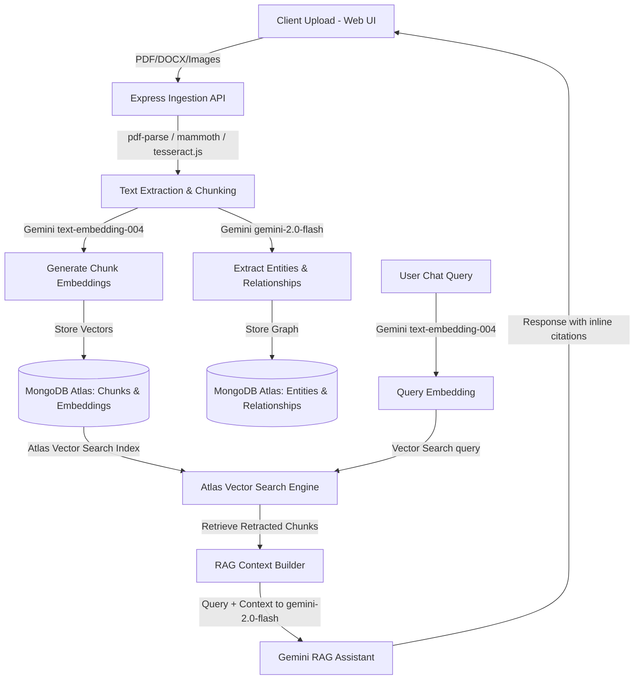

# Unified Asset & Operations Brain (ET AI Hackathon 2026)
## AI for Industrial Knowledge Intelligence: Problem Statement 8

A hackathon-grade operations prototype for plant engineers and maintenance leads. It fuses technical drawings, manuals, safety guidelines (OISD / Factory Act), and inspection reports into a single, AI-queryable repository. Powered by **React, Vite, Express, and MongoDB**, with built-in hybrid semantic search capabilities.

---

## 🏗️ Architecture Design



---

## ⚡ Setup & Launch in under 5 Minutes

The application is structured as a monorepo with separate `frontend` and `backend` folders, fully configured to run with or without external API credentials (contains **offline database/AI simulation modes**).

### Prerequisites
- [Node.js](https://nodejs.org/) v18+ (tested on v24.16.0)
- npm v9+

### 1. Installation
Install dependencies in both directories:
```bash
# In the backend directory
cd backend
npm install

# In the frontend directory
cd ../frontend
npm install
```

### 2. Environmental Setup
Configure the environment variables in `backend/.env`. (An `.env.example` has been created for reference).
```env
PORT=5000
MONGODB_URI=mongodb://127.0.0.1:27017/industrial_brain
GEMINI_API_KEY=
```

### 3. Startup (Run in parallel or separate terminal shells)

**Start the Backend API:**
```bash
cd backend
npm start
```
*Note: If no local or cloud MongoDB is connected, the server outputs connection errors but runs with complete inline fallback schemas and logic.*

**Start the Frontend App:**
```bash
cd frontend
npm run dev
```
Open **`http://localhost:3000/`** in your browser.

---

## 🛠️ Main Feature Modules

1. **Dashboard Overview**: Data visualization widgets mapping total operational assets, compliance ratings, safety metrics, and historical downtime metrics powered by Recharts.
2. **Expert Knowledge Copilot**: High-density operational chat assistant. Answers questions using grounded citations linked back to specific page references and document sources.
3. **Equipment & RCA Panel**: Reliability workspace. Input equipment tags (e.g. `P-101`, `C-102`) to calculate predictive health scores, view active work orders, and review AI-generated Root Cause Analysis.
4. **Compliance Gaps Dashboard**: Heatmap checklist tracking safety protocols (OISD-189, Factory Act Section 38, PESO Cylinder Rules). Includes one-click **"Export Audit Evidence Package"** downloading formal reports.
5. **Lessons Learned Feed**: Scans historical plant logs for overlapping failure patterns and raises smart alarm notification cards.
6. **Document Vault**: File upload drag-and-drop zone. Shows ingestion stages (`Parsing` -> `Embedding` -> `Indexing`) as documents undergo OCR (Tesseract.js) or textual parsing.

---

## 📐 Atlas Vector Search Index Configuration
When deploying with an active MongoDB Atlas cluster, create a **Search Index** on the `chunks` collection with the name `vector_index` using the JSON definition:
```json
{
  "fields": [
    {
      "type": "vector",
      "path": "embedding",
      "numDimensions": 768,
      "similarity": "cosine"
    }
  ]
}
```
